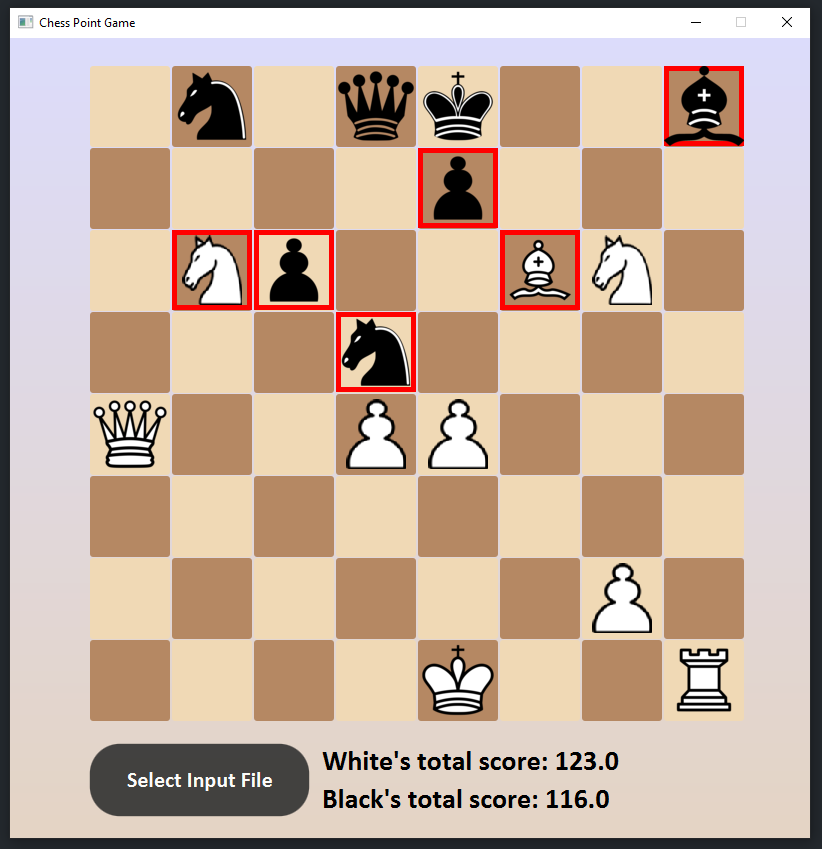
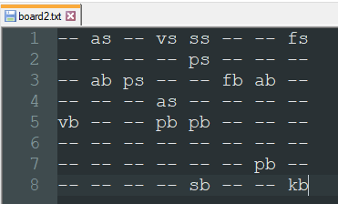

# Chess-Point-Game
## Its a simple project that counts the points of white and black pieces using Java with JavaFX.
#### Each time the "Select Input File" button is clicked, a file manager will appear on the screen.
#### From here you must select the correct formatted file on your system.
#### Then you will see that the game board is drawn according to the file you selected.
#### The squares surrounded by a red border indicates that the piece in that square is under threat.
#### You can also see the total points of the white and black pieces at the bottom of the screen.

##### Pawns are 1 point.(While under threat 0.5 point)
##### Knights are 3 point.(While under threat 1.5 point)
##### Bishops are 3 point.(While under threat 1.5 point)
##### Rooks are 5 point.(While under threat 2.5 point)
##### Queens are 9 point.(While under threat 4.5 point)
##### Kings are 100 point.(While under threat 50.0 point)
### According to this example:
#### White's total score: (1 * 3) + (1.5 * 2) + (3 * 1) + (5 * 1) + (9 * 1) + (100 * 1) = 123.0 points
#### Black's total score: (0.5 * 2) + (1.5 * 2) + (3 * 1) + (9 * 1) + (100 * 1) = 116.0 points
### Sample input format: 

##### pb --> White pawn
##### ps --> Black pawn
##### ab --> White knight
##### as --> Black knight
##### fb --> White bishop
##### fs --> Black bishop
##### kb --> White rook
##### ks --> Black rook
##### vb --> White queen
##### vs --> Black queen
##### sb --> White king
##### ss --> Black king
